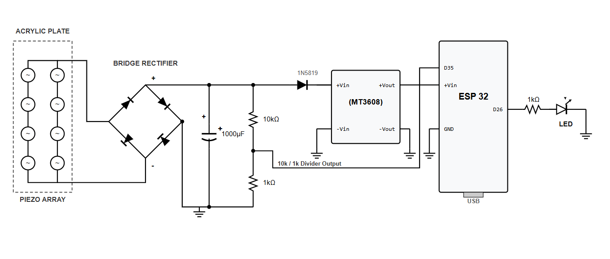

# Footstep Power Generation ⚡

Harvesting mechanical energy from human footsteps using piezoelectric transducers and an ESP32 IoT Dashboard.

## 📖 Overview
This project presents the design, implementation, and experimental validation of a Footstep Power Generation System that harvests piezoelectric energy from human footsteps and conditions it for practical utilization using modern power electronics and microcontroller-based IoT monitoring. The system demonstrates the feasibility of piezoelectric energy harvesting for low-power distributed infrastructure in high-footfall environments.

## 🛠️ Hardware Architecture
The hardware acts as a complete power conditioning chain from mechanical input to stable DC output:
* **Piezoelectric Array:** The system employs eight piezoelectric (PZT-type) disc sensors arranged in two parallel branches, each containing four sensors in series, to achieve an optimised balance between output voltage and charge delivery.
* **Rectification & Storage:** The raw AC output from the piezo array is rectified by a full-wave bridge rectifier and stored in a 1000 µF electrolytic capacitor. 
* **Voltage Regulation:** A Schottky diode prevents reverse discharge, and an MT3608 DC-DC boost converter steps up the harvested voltage to a stable 5V for the ESP32 microcontroller.
* **Load Indicator:** GPIO26 drives an LED when the harvested voltage crosses the activation threshold.

  

## 💻 Firmware & IoT Dashboard
A major feature of the project is the live IoT web dashboard hosted by the ESP32 over Wi-Fi. 
* **Server-Sent Events (SSE):** The dashboard updates in real time without requiring any page refresh, using Server-Sent Events (SSE).
* **Live Metrics:** The dashboard displays real-time step count, capacitor voltage, stored energy, peak voltage, average voltage, steps per minute, a live voltage waveform, and a session timer.
* **Step Detection:** Step detection uses a 12-bit ADC threshold of 1800 counts on GPIO35, with a 450 ms debounce delay.

## 📊 Experimental Results
* **Voltage per Step:** Experimental results show that each footstep (68 kg subject) increments the capacitor voltage by approximately 0.18 V.
* **Activation Threshold:** 12-14 steps are sufficient to reach the LED activation threshold.

## 📂 Repository Structure
* `/firmware`: Contains the ESP32 source code for step detection, ADC monitoring, and the web server.
* `/hardware`: Contains circuit diagrams, block diagrams, and photographs of the prototype setup.
* `/docs`: Contains the detailed mathematical analysis, graphical plots, and the full project report.

## 🚀 How to Run
1. Wire the ESP32 to the MT3608 output and the voltage divider to GPIO35 as per the hardware schematics.
2. Open the code in `/firmware` using the Arduino IDE.
3. Update the `ssid` and `password` variables with your local Wi-Fi credentials.
4. Flash the code to the ESP32.
5. Open the Serial Monitor at 115200 baud to find the dynamically assigned IP address.
6. Enter the IP address into any web browser on the same network to view the live dashboard.

## Contributors:
1. Atharva Durge
2. Arnika Gade
3. Sanyukta Gharde
